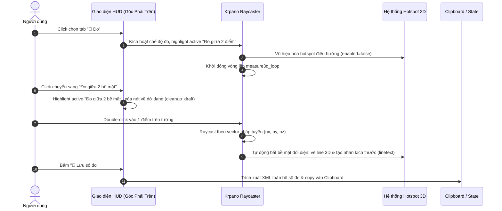
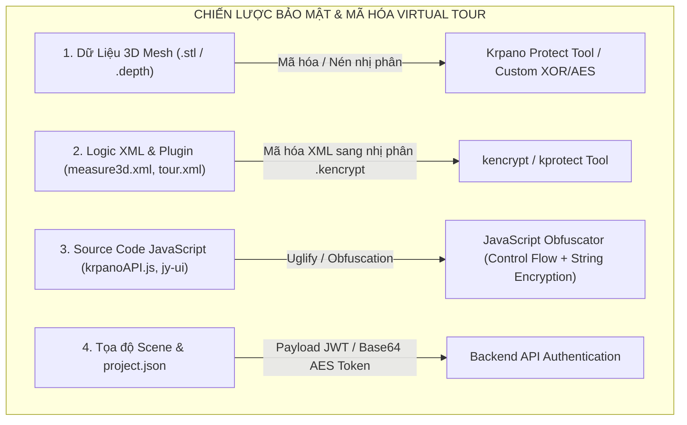

# Báo Cáo Tổng Hợp & Hướng Dẫn Kỹ Thuật: Chức Năng Thước Đo 3D (Measure3D Plugin) Trong Krpano

> **Dự án**: Căn hộ ảo 3D Virtual Tour (360 Parallax & Depthmap)  
> **Tài liệu cho**: Thẻ `<include url="plugins/measure3d.xml" />` tại dòng 4 trong [tour.xml](file:///Users/gokuwebdev/Documents/GitHub/measure_3d/can1pn/tour.xml#L4)  
> **File plugin thực thi**: [measure3d.xml](file:///Users/gokuwebdev/Documents/GitHub/measure_3d/can1pn/plugins/measure3d.xml)  
> **Phiên bản Krpano hỗ trợ**: Krpano 1.22+ / 1.23 WebGL Depthmap Engine  
> **Ngày cập nhật**: 14/08/2026  

---

## 1. Tổng Quan Về Thẻ `<include url="plugins/measure3d.xml" />`

Dòng lệnh `<include url="plugins/measure3d.xml" />` tại dòng số 4 trong file cấu hình [tour.xml](file:///Users/gokuwebdev/Documents/GitHub/measure_3d/can1pn/tour.xml#L4) có nhiệm vụ nạp module **Thước đo không gian 3D (Measure3D Plugin)** vào toàn bộ vòng đời của Virtual Tour.

Đây là một tính năng chuyên sâu tận dụng kiến trúc **3D Mesh / Depthmap (file `model.stl`)** kết hợp hệ tọa độ không gian thật từ Blender/3D Model để cung cấp cho người dùng khả năng đo đạc kích thước thực tế (chiều cao trần, chiều rộng cửa sổ/cửa đi, khoảng cách đồ nội thất, diện tích khoảng trống, độ dốc...) trực tiếp trên trình duyệt web với độ chính xác theo tỷ lệ chuẩn mm/cm/m.

```mermaid
graph TD
    subgraph KRPANO_CORE [KRPANO ENGINE CORE]
        A["tour.xml (Root Config)"] -->|Line 4: Include| B["plugins/measure3d.xml"]
        A -->|Display Config| C["depthmaprendermode='3dmodel'<br/>depthbuffer='true'"]
        D["Depthmap Model (.stl)"] -->|Hit-testing & Raycasting| E["WebGL Raycaster Engine"]
    end
    
    subgraph MEASURE3D_MODULE [MEASURE3D MODULE ARCHITECTURE]
        B --> F["HUD UI Panel (MUI Style SVG & Glassmorphism - Top Right)"]
        B --> G["Mode Controller (Walk Mode vs Measure Mode)"]
        B --> H["Submode Handler (Point-to-Point vs Surface-to-Surface Active States)"]
        B --> I["Drawing & Calculation Engine (Lines, Markers, Distance, Slope)"]
        E -->|Tọa độ thực X, Y, Z & Pháp tuyến Normal nx, ny, nz| I
    end

    subgraph SYSTEM_INTEGRATION [SYSTEM INTEGRATION & CONFLICT RESOLUTION]
        G -->|Vô hiệu hóa Hotspot di chuyển| J["Navigation Lock (hs.enabled = false)"]
        G -->|Khóa cơ chế click chuyển scene| K["krpano.jyNavEnabled = true"]
        F -->|Hover Panel (overMeasureUI = true)| L["Ẩn hotspot_mouse, arrow & measure3d_cursor"]
        F -->|CSS Isolation| M["Chỉ ẩn cursor trên #pano canvas, khôi phục OS cursor trên UI"]
        I -->|Xuất mã XML cấu hình| N["Clipboard / Backend API Storage"]
    end
```

---

## 2. Phân Tích Mối Quan Hệ Giữa `tour.xml` & `measure3d.xml`

Trong [tour.xml](file:///Users/gokuwebdev/Documents/GitHub/measure_3d/can1pn/tour.xml), việc tích hợp và thực thi `measure3d.xml` gắn liền với các thành phần cốt lõi:

```xml
<krpano version="1.23" title="Virtual Tour">
    <!-- 1. Include Module Đo 3D -->
    <include url="plugins/measure3d.xml" />

    <!-- 2. Bật WebGL 3D Model Render & Depth Buffer -->
    <display depthmaprendermode="3dmodel" />
    <display depthbuffer="true" />

    <!-- 3. Khởi tạo Scene & Tọa độ Camera 3D ban đầu -->
    <action autorun="onstart" name="startup">
        loadscene(get(scene[0].name),null,null,BLEND(0.5));
        set(view.tx,get(image.ox));
        set(view.ty,get(image.oy));
        set(view.tz,get(image.oz));
        js(readyAddScene());
    </action>

    <!-- 4. Khai báo Scene với mô hình 3D STL dùng cho Raycasting -->
    <scene model="true" name="scene_1_1pn" title="PHÒNG Bếp + Ăn" onstart="showFlootHotspot();" thumburl="panos/1_1pn.tiles/thumb.jpg" type="panorama">
        <image ox="649.39" oy="-1049.13" oz="-2516.8" origin="-6.49, 10.49, 25.17" align="-0.0|-0.39|0.0" prealign="-0.0|0.39|0.0" style="jypano_1_1pn">
            <cube url="panos/1_1pn.tiles/%s/l%l/%0v/l%l_%s_%0v_%0h.jpg" multires="512,640,1152,2304,4736" />
            <depthmap url="panos/1_1pn.tiles/model.stl" enabled="true" rendermode="3dmodel" background="none" scale="100" offset="0.0" subdiv="" hittest="true" />
        </image>
    </scene>
</krpano>
```

### Các điều kiện kỹ thuật bắt buộc từ `tour.xml`:
1. `<display depthmaprendermode="3dmodel" />` & `<display depthbuffer="true" />`: Bắt buộc để WebGL kích hoạt tính năng kiểm tra độ sâu chiều không gian, render lưới đa giác 3D và cho phép hàm `cursorraycast()` hoạt động.
2. `<depthmap url=".../model.stl" ... hittest="true" />`: Thuộc tính `hittest="true"` cho phép tia raycast từ trỏ chuột va chạm và bắt điểm chính xác trên bề mặt lưới STL.
3. `ox, oy, oz` trong thẻ `<image>` và `style`: Thiết lập gốc tọa độ vị trí đặt máy ảnh trong mô hình 3D, đảm bảo khoảng cách tính toán từ camera đến các bề mặt đồng nhất với không gian thực tế.

---

## 3. Kiến Trúc Kỹ Thuật & Cơ Chế Hoạt Động (Deep Dive)

### 3.1. Cơ Chế Dò Tia (Raycasting) và Bắt Điểm 3D
1. **Raycasting từ con trỏ chuột (`krpano.cursorraycast()`)**: 
   - Trong vòng lặp `asyncloop("measure3d_loop", ...)`, Krpano liên tục phóng một tia từ tâm camera qua vị trí con trỏ chuột $(x_{screen}, y_{screen})$ vào không gian WebGL 3D.
2. **Giao điểm với lưới 3D (`model.stl`)**: 
   - Hàm trả về đối tượng `hit` chứa tọa độ không gian 3 chiều $(hit.x, hit.y, hit.z)$, các góc xoay bề mặt $(hit.rx, hit.ry, hit.rz)$ và vector pháp tuyến đơn vị $(hit.nx, hit.ny, hit.nz)$.
3. **Bù khoảng cách bề mặt (`gap`)**:
   - Để tránh hiện tượng dính bề mặt (Z-fighting), vị trí con trỏ và điểm đo được dịch chuyển nhẹ theo hướng vector pháp tuyến:
     $$\vec{P}_{marker} = \vec{P}_{hit} + \vec{n} \times gap$$

### 3.2. Công Thức Tính Toán Khoảng Cách & Góc Nghiêng
1. **Khoảng cách không gian Euclid (3D Euclidean Distance)**:
   $$d = \sqrt{(x_2 - x_1)^2 + (y_2 - y_1)^2 + (z_2 - z_1)^2}$$
2. **Góc nghiêng/Độ dốc so với mặt phẳng ngang (Slope Angle)**:
   $$\theta = \left| \arctan2(-dy, \sqrt{dx^2 + dz^2}) \times \frac{180}{\pi} \right|^\circ$$



---

## 4. Chi Tiết Các Tính Năng Đã Hoàn Thiện Trong `measure3d.xml`

### 4.1. Giao Diện Chuẩn Material Design (MUI Style Icons & Top-Right Position)
- **Vị trí cố định góc trên bên phải**: Cấu hình `ui_pos.normal="righttop,20,20"` và `ui_pos.mobile="righttop,10,10"` giúp panel không che khuất các nút điều hướng chính ở góc dưới hay giữa màn hình.
- **Biểu tượng Vector MUI SVG sắc nét**: Header (`StraightenRounded`), Tab Đi (`DirectionsWalkRounded`), Tab Đo (`SquareFootRounded`), Nút Đo 2 điểm (`LinearScaleRounded`), Nút Đo bề mặt (`SwapHorizRounded`), Nút Lưu (`SaveRounded`).
- **Hiệu ứng Active Item (`.m3d_btn_active`)**: Phân biệt trực quan chế độ đo đang chọn bằng nền cam nổi bật, viền highlight và icon box phát sáng.

### 4.2. Hai Phương Thức Đo Đạc Linh Hoạt
1. **Đo giữa 2 điểm tự do (`start_measuring_between_points` - Type 1)**:
   - Double-click chọn **Điểm 1** $\rightarrow$ Rê chuột $\rightarrow$ Double-click chốt **Điểm 2**.
2. **Đo giữa 2 bề mặt đối diện (`start_measuring_between_surfaces` - Type 2)**:
   - Double-click vào một điểm trên tường/sàn $\rightarrow$ Hệ thống tự động bắn tia vuông góc theo vector pháp tuyến $(nx, ny, nz)$ qua `krpano.raycast()` để tìm điểm giao với bức tường/trần đối diện và tự động chốt kích thước.

### 4.3. Quản Lý & Dọn Dẹp Nét Vẽ Dở Dang (`m3d_cleanup_draft`)
- Khi người dùng đang đo dở (chấm 1 điểm) nhưng đổi ý chuyển sang chế độ khác, hàm `window.m3d_cleanup_draft()` tự động xóa sạch điểm neo và đường line tạm để tránh rác màn hình.
- **Hover/Click để xóa**: Click vào nhãn số đo hiển thị `❌ Delete`. Click lần 2 xóa hoàn toàn đoạn thẳng và 2 marker đầu mút.

### 4.4. Giữ Số Đo Khi Chuyển Cảnh (`keep="true"`)
- Tất cả các đối tượng vẽ thước đo (`line`, `p1marker`, `p2marker`, `lineinfo`) đều được gắn cờ `keep = true`. Nhờ các scene dùng chung mô hình 3D STL và gốc tọa độ thống nhất, khi người dùng di chuyển giữa các phòng, các kích thước đã đo vẫn nằm đúng vị trí trong không gian.

---

## 5. Bảng Cấu Hình Tham Số Trong `measure3d.xml`

Thẻ cấu hình gốc tại đầu file [measure3d.xml](file:///Users/gokuwebdev/Documents/GitHub/measure_3d/can1pn/plugins/measure3d.xml#L14-L22):

```xml
<measure3d
    ui.bool="true"
    ui_pos.normal="righttop,20,20"
    ui_pos.mobile="righttop,10,10"
    ui_dragable.bool="true"
    gap.number="0.0"
    showslope.bool="false"
    unit_format="roundval(v,1) + ' cm'"
/>
```

### Bảng giải thích chi tiết:

| Thuộc Tính | Kiểu Dữ Liệu | Giá Trị Mặc Định | Mô Tả Chức Năng |
| :--- | :---: | :---: | :--- |
| `ui` | `boolean` | `true` | Bật/tắt thanh điều khiển HUD giao diện đo đạc trên màn hình. |
| `ui_pos.normal` | `string` | `"righttop,20,20"` | Vị trí neo của panel HUD trên desktop (Góc trên bên phải). |
| `ui_pos.mobile` | `string` | `"righttop,10,10"` | Vị trí neo của panel HUD trên thiết bị di động. |
| `ui_dragable` | `boolean` | `true` | Cho phép người dùng kéo thả panel HUD tự do trên màn hình. |
| `gap` | `number` | `0.0` | Khoảng cách bù offset theo phương pháp tuyến bề mặt để tránh dính hình (Z-fighting). |
| `showslope` | `boolean` | `false` | Hiển thị thêm góc nghiêng (độ dốc tính bằng độ `°`) bên dưới giá trị khoảng cách. |
| `unit_format` | `expression` | `"roundval(v,1) + ' cm'"` | Công thức định dạng đơn vị đo (`' cm'`, `' m'`, `' mm'`). |

---

## 6. Các Cơ Chế Giải Quyết Xung Đột Hệ Thống (Conflict Resolution)

### 6.1. Khắc Phục Lỗi Con Trỏ Chuột Hover Popup
- **Phân tách CSS**: [index.html](file:///Users/gokuwebdev/Documents/GitHub/measure_3d/can1pn/index.html) chỉ áp dụng `cursor: none !important` cho `#pano canvas`, đảm bảo con trỏ chuột hệ điều hành (`default`, `pointer`, `move`) hiển thị rõ ràng trên panel UI.
- **Ẩn toàn bộ con trỏ 3D khi hover UI**: Khi `krpano.overMeasureUI === true`:
  * [krpanoAPI.js](file:///Users/gokuwebdev/Documents/GitHub/measure_3d/can1pn/plugins/utils/krpanoAPI.js): Ẩn con trỏ đĩa sàn `hotspot_mouse`.
  * [cursor-arrow.js](file:///Users/gokuwebdev/Documents/GitHub/measure_3d/can1pn/plugins/utils/cursor-arrow.js): Ẩn mũi tên định hướng `hotspot_mouse_arrow`.
  * [measure3d.xml](file:///Users/gokuwebdev/Documents/GitHub/measure_3d/can1pn/plugins/measure3d.xml): Ẩn con trỏ đo tròn `measure3d_cursor`.

### 6.2. Đảm Bảo Chuẩn Cú Pháp XML (CDATA Encapsulation)
- Toàn bộ các script JavaScript bên trong `<action ... type="Javascript">` đều được bao bọc bởi khối `<![CDATA[ ... ]]>`, loại trừ hoàn toàn các lỗi phân tích cú pháp XML (`xmlParseEntityRef: no name` do các ký tự `&&`, `<`, `>` gây ra).

### 6.3. Tự Động Hủy Đo Khi Đổi Scene ([config.xml](file:///Users/gokuwebdev/Documents/GitHub/measure_3d/can1pn/plugins/jy-config/config.xml#L244))
- Trong action `showFlootHotspot` khi chuyển cảnh:
  ```xml
  <action name="showFlootHotspot" scope="local">
      if(measure3d_loop, stop_measuring(); );
      ...
  </action>
  ```
  Giúp đảm bảo thoát trạng thái đo dở dang nhưng vẫn lưu giữ các đường đo đã vẽ hoàn thành trên không gian 3D.

### 6.4. Cơ Chế Khử Nhìn Xuyên Tường (WebGL Depth Buffer Occlusion)
- **Vấn đề**: Khi người dùng đo ở một phòng (vd: Phòng Bếp) rồi di chuyển sang phòng khác (vd: Phòng Ngủ), các đường đo và nhãn kích thước không được vẽ đè lên tường chắn phía trước (X-ray effect).
- **Giải pháp**:
  - Bật `depthbuffer="true"` cho `measure3d_line`, `measure3d_marker`, `measure3d_linetext`, `measure3d_cursor`.
  - Tinh chỉnh `depthoffset="-20"` đến `"-30"` để nhãn và đường thẳng nổi nhẹ trên bề mặt tường đo chống hiện tượng Z-fighting, nhưng vẫn bị các bức tường nằm giữa camera và điểm đo che khuất tự nhiên theo đúng tầm nhìn thực tế (Line-of-Sight).

---

## 7. Hướng Dẫn & Khuyến Nghị Mã Hóa Bảo Mật (Security & IP Protection)

Để bảo vệ bí mật công nghệ, thuật toán tính toán và dữ liệu mô hình 3D của công ty khỏi việc bị sao chép hoặc trích xuất trái phép, dưới đây là chiến lược bảo mật toàn diện:



### Các thành phần cần mã hóa ưu tiên:

| Thành Phần | Định Dạng File | Mức Độ Nhạy Cảm | Phương Pháp Mã Hóa Khuyến Nghị |
| :--- | :--- | :---: | :--- |
| **Lưới 3D Không Gian** | `model.stl` | **RẤT CAO** (Bí mật kiến trúc) | Đổi sang định dạng mã hóa `.depth` của Krpano hoặc mã hóa nhị phân tùy chỉnh giải mã trong WebGL memory. |
| **Logic Thước Đo 3D** | `measure3d.xml`, `walk.xml` | **CAO** (Bản quyền thuật toán) | Sử dụng công cụ `kencrypt` của Krpano để mã hóa file XML thành file nhị phân mã hóa không thể đọc dạng text. |
| **API Core & Navigation** | `krpanoAPI.js`, `cursor-arrow.js` | **CAO** (Logic sản phẩm) | Sử dụng **JavaScript Obfuscator** (Control Flow Flattening, Mangling Variable Names, String Array Encryption). |
| **Dữ Liệu Dự Án** | `project.json`, `mini-map.json` | **TRUNG BÌNH** (Thông tin layout) | Tải qua REST API có xác thực Token/Signature thay vì lưu file tĩnh công khai. |

---

## 8. Checklist Kiểm Thử Nhanh (Verification Checklist)

| STT | Thao Tác Kiểm Tra | Kết Quả Đạt Chuẩn |
| :---: | :--- | :--- |
| 1 | Rê chuột vào panel UI góc trên bên phải | Con trỏ chuột OS hiển thị chuẩn xác (mũi tên, bàn tay pointer, move). Con trỏ sàn 360 & mũi tên ẩn hoàn toàn. |
| 2 | Bật tab **📏 Đo** | Tab Đo sáng cam, nút **Đo giữa 2 điểm** được highlight active mặc định. |
| 3 | Click nút **Đo giữa 2 bề mặt** | Nút **Đo giữa 2 bề mặt** đổi sang active, xóa nét vẽ dở nếu có. Double-click tường tự bắt khoảng cách lọt lòng. |
| 4 | Click lại **Đo giữa 2 điểm** | Trạng thái active chuyển sang nút 2 điểm ngay lập tức. Double-click 2 điểm tự do hoạt động bình thường. |
| 5 | Rê chuột vào nhãn số đo và click | Nhãn đổi sang `❌ Delete` và click lần 2 xóa sạch đường đo. |
| 6 | Chuyển sang scene/phòng khác | Các đường đo đã vẽ vẫn cố định chính xác tại vị trí cũ trong không gian 3D. |
| 7 | Bấm nút **💾 Lưu số đo** | Toàn bộ thẻ XML của số đo được sao chép vào Clipboard và hiển thị thông báo popup. |
| 8 | Nhấn phím **ESC** hoặc tab **🚶 Đi** | Thoát chế độ đo lập tức, khôi phục tương tác chuyển cảnh thông thường. |
