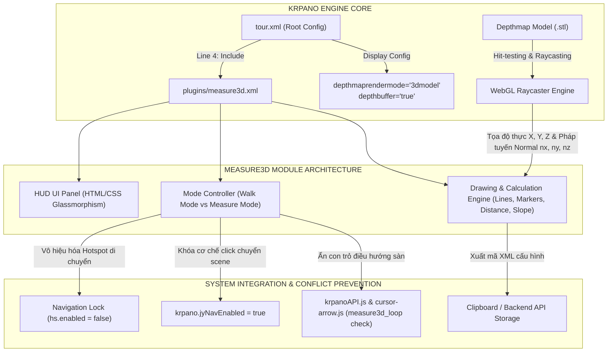
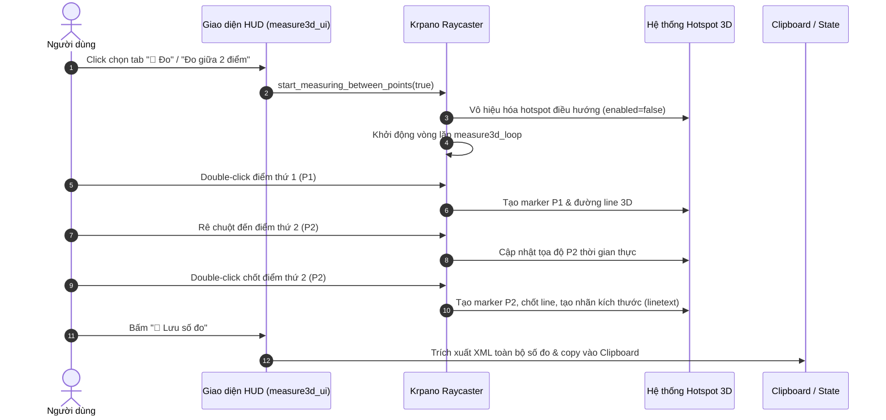

# Báo Cáo Tổng Hợp & Hướng Dẫn Kỹ Thuật: Chức Năng Thước Đo 3D (Measure3D Plugin) Trong Krpano

> **Dự án**: Căn hộ ảo 3D Virtual Tour (360 Parallax & Depthmap)  
> **Tài liệu cho**: Thẻ `<include url="plugins/measure3d.xml" />` tại dòng 4 trong [tour.xml](file:///Users/gokuwebdev/Documents/GitHub/measure_3d/can1pn/tour.xml#L4)  
> **File plugin thực thi**: [measure3d.xml](file:///Users/gokuwebdev/Documents/GitHub/measure_3d/can1pn/plugins/measure3d.xml)  
> **Phiên bản Krpano hỗ trợ**: Krpano 1.22+ / 1.23 WebGL Depthmap Engine  
> **Ngày cập nhật**: 14/08/2026  

---

## 1. Tổng Quan Về Thẻ `<include url="plugins/measure3d.xml" />`

Dòng lệnh `<include url="plugins/measure3d.xml" />` tại dòng số 4 trong file cấu hình [tour.xml](file:///Users/gokuwebdev/Documents/GitHub/measure_3d/can1pn/tour.xml#L4) có nhiệm vụ nạp module **Thước đo không gian 3D (Measure3D Plugin)** vào toàn bộ vòng đời của Virtual Tour.

Đây là một tính năng chuyên sâu tận dụng kiến trúc **3D Mesh / Depthmap (file `model.stl`)** kết hợp hệ tọa độ không gian thật từ Blender/3D Model để cung cấp cho người dùng khả năng đo đạc kích thước thực tế (chiều cao trần, chiều rộng cửa sổ/cửa đi, khoảng cách đồ nội thất, diện tích khoảng trống, độ dốc...) trực tiếp trên trình duyệt web với độ chính xác theo tỷ lệ chuẩn mm/cm/m.



---

## 2. Phân Tích Mối Quan Hệ Giữa `tour.xml` & `measure3d.xml`

Trong [tour.xml](file:///Users/gokuwebdev/Documents/GitHub/measure_3d/can1pn/tour.xml), việc tích hợp và thực thi `measure3d.xml` gắn liền với các thành phần cốt lõi sau:

```xml
<krpano version="1.23" title="Virtual Tour">
    <!-- 1. Include Module Đo 3D -->
    <include url="plugins/measure3d.xml" />

    <!-- 2. Bật WebGL 3D Model Render & Depth Buffer -->
    <display depthmaprendermode="3dmodel" />
    <display depthbuffer="true" />

    <!-- 3. Khởi tạo Scene & Tọa độ Camera 3D ban đầu -->
    <action autorun="onstart" name="startup">
        loadscene(get(scene[0].name),null,null,BLEND(0.5));
        set(view.tx,get(image.ox));
        set(view.ty,get(image.oy));
        set(view.tz,get(image.oz));
        js(readyAddScene());
    </action>

    <!-- 4. Khai báo Scene với mô hình 3D STL dùng cho Raycasting -->
    <scene model="true" name="scene_1_1pn" title="PHÒNG Bếp + Ăn" onstart="showFlootHotspot();" thumburl="panos/1_1pn.tiles/thumb.jpg" type="panorama">
        <image ox="649.39" oy="-1049.13" oz="-2516.8" origin="-6.49, 10.49, 25.17" align="-0.0|-0.39|0.0" prealign="-0.0|0.39|0.0" style="jypano_1_1pn">
            <cube url="panos/1_1pn.tiles/%s/l%l/%0v/l%l_%s_%0v_%0h.jpg" multires="512,640,1152,2304,4736" />
            <depthmap url="panos/1_1pn.tiles/model.stl" enabled="true" rendermode="3dmodel" background="none" scale="100" offset="0.0" subdiv="" hittest="true" />
        </image>
    </scene>
</krpano>
```

### Các điều kiện kỹ thuật bắt buộc từ `tour.xml`:
1. `<display depthmaprendermode="3dmodel" />` & `<display depthbuffer="true" />`: Bắt buộc để WebGL kích hoạt tính năng kiểm tra độ sâu chiều không gian, render lưới đa giác 3D và cho phép hàm `cursorraycast()` hoạt động.
2. `<depthmap url=".../model.stl" ... hittest="true" />`: Thuộc tính `hittest="true"` cho phép tia raycast từ trỏ chuột va chạm và bắt điểm chính xác trên bề mặt lưới STL.
3. `ox, oy, oz` trong thẻ `<image>` và `style`: Thiết lập gốc tọa độ vị trí đặt máy ảnh trong mô hình 3D, đảm bảo khoảng cách tính toán từ camera đến các bề mặt đồng nhất với không gian thực tế.

---

## 3. Kiến Trúc Kỹ Thuật & Cơ Chế Hoạt Động (Deep Dive)

### 3.1. Cơ Chế Dò Tia (Raycasting) và Bắt Điểm 3D
1. **Raycasting từ con trỏ chuột (`krpano.cursorraycast()`)**: 
   - Trong vòng lặp `asyncloop("measure3d_loop", ...)`, Krpano liên tục phóng một tia từ tâm camera qua vị trí con trỏ chuột $(x_{screen}, y_{screen})$ vào không gian WebGL 3D.
2. **Giao điểm với lưới 3D (`model.stl`)**: 
   - Hàm trả về đối tượng `hit` chứa tọa độ không gian 3 chiều $(hit.x, hit.y, hit.z)$, các góc xoay bề mặt $(hit.rx, hit.ry, hit.rz)$ và vector pháp tuyến đơn vị $(hit.nx, hit.ny, hit.nz)$.
3. **Bù khoảng cách bề mặt (`gap`)**:
   - Để tránh hiện tượng dính bề mặt (Z-fighting), vị trí con trỏ và điểm đo được dịch chuyển nhẹ theo hướng vector pháp tuyến:
     $$\vec{P}_{marker} = \vec{P}_{hit} + \vec{n} \times gap$$

### 3.2. Công Thức Tính Toán Khoảng Cách & Góc Nghiêng
1. **Khoảng cách không gian Euclid (3D Euclidean Distance)**:
   $$d = \sqrt{(x_2 - x_1)^2 + (y_2 - y_1)^2 + (z_2 - z_1)^2}$$
2. **Góc nghiêng/Độ dốc so với mặt phẳng ngang (Slope Angle)**:
   $$\theta = \left| \arctan2(-dy, \sqrt{dx^2 + dz^2}) \times \frac{180}{\pi} \right|^\circ$$



---

## 4. Chi Tiết Các Tính Năng Trong `measure3d.xml`

### 4.1. Chuyển Đổi Trạng Thái Segmented (Walk Mode vs Measure Mode)
- **🚶 Đi (Walk Mode)**: Chế độ tham quan tour thông thường. Tất cả các sự kiện click, chuyển scene, con trỏ chuột sàn (`hotspot_mouse`, `cursor-arrow`) hoạt động chuẩn xác.
- **📏 Đo (Measure Mode)**: Bật chế độ đo đạc. Tự động vô hiệu hóa các hotspot di chuyển và chặn chuyển scene khi double-click.

### 4.2. Hai Phương Thức Đo Đạc
1. **Đo giữa 2 điểm tự do (`start_measuring_between_points`)**:
   - Double-click chọn **Điểm 1** $\rightarrow$ Rê chuột $\rightarrow$ Double-click chốt **Điểm 2**.
2. **Đo giữa 2 bề mặt đối diện (`start_measuring_between_surfaces`)**:
   - Double-click vào một điểm trên tường/sàn $\rightarrow$ Hệ thống tự động bắn một tia vuông góc theo vector pháp tuyến $(nx, ny, nz)$ qua hàm `krpano.raycast(hs.tx, hs.ty, hs.tz, hs.nx, hs.ny, hs.nz)` để tìm điểm giao với bức tường/trần đối diện và tự động chốt kích thước.

### 4.3. Quản Lý & Xóa Đoạn Đo Đã Tạo
- Mỗi đoạn đo sinh ra một nhãn văn bản 3D (`measure3d_linetext`) tại trung điểm đoạn thẳng:
  $$P_{center} = 0.5 \times P_1 + 0.5 \times P_2$$
- **Hover/Click để xóa**: Khi rê chuột hoặc click vào nhãn số đo, nội dung nhãn chuyển sang `❌ Delete`. Click lần nữa sẽ xóa sạch đoạn thẳng, 2 marker đầu mút và chính nhãn đó.

### 4.4. Giữ Số Đo Khi Chuyển Cảnh (`keep="true"`)
- Tất cả các đối tượng vẽ thước đo (`line`, `p1marker`, `p2marker`, `lineinfo`) đều được thiết lập `keep = true`. Nhờ các scene dùng chung mô hình 3D STL và gốc tọa độ thống nhất, khi người dùng di chuyển giữa các phòng, các kích thước đã đo vẫn nằm đúng vị trí trong không gian.

### 4.5. Xuất Dữ Liệu Đo Đạc (`save_measurements`)
- Quét toàn bộ hotspot có style thuộc nhóm thước đo (`measure3d_line`, `measure3d_linetext`, `measure3d_marker`), xuất ra chuỗi XML nguyên bản và ghi vào Clipboard thông qua `navigator.clipboard.writeText(xmlcode)`.

---

## 5. Bảng Cấu Hình Tham Số Trong `measure3d.xml`

Thẻ cấu hình gốc tại đầu file [measure3d.xml](file:///Users/gokuwebdev/Documents/GitHub/measure_3d/can1pn/plugins/measure3d.xml#L14-L22):

```xml
<measure3d
    ui.bool="true"
    ui_pos.normal="left,10,0"
    ui_pos.mobile="lefttop,10,10"
    ui_dragable.bool="true"
    gap.number="0.0"
    showslope.bool="false"
    unit_format="roundval(v,1) + ' cm'"
/>
```

### Bảng giải thích chi tiết:

| Thuộc Tính | Kiểu Dữ Liệu | Giá Trị Mặc Định | Mô Tả Chức Năng |
| :--- | :---: | :---: | :--- |
| `ui` | `boolean` | `true` | Bật/tắt thanh điều khiển HUD giao diện đo đạc trên màn hình. |
| `ui_pos.normal` | `string` | `"left,10,0"` | Vị trí neo của panel HUD trên desktop: `[align, x, y]`. |
| `ui_pos.mobile` | `string` | `"lefttop,10,10"` | Vị trí neo của panel HUD trên thiết bị di động / màn hình nhỏ. |
| `ui_dragable` | `boolean` | `true` | Cho phép người dùng kéo thả panel HUD tự do trên màn hình. |
| `gap` | `number` | `0.0` | Khoảng cách bù offset theo phương vector pháp tuyến bề mặt để tránh dính hình (Z-fighting). |
| `showslope` | `boolean` | `false` | Hiển thị thêm góc nghiêng (độ dốc tính bằng độ `°`) bên dưới giá trị khoảng cách. |
| `unit_format` | `expression` | `"roundval(v,1) + ' cm'"` | Công thức định dạng đơn vị đo (`' cm'`, `' m'`, `' mm'`). |

---

## 6. Các Cơ Chế Giải Quyết Xung Đột Hệ Thống (Conflict Resolution)

Trong hệ thống Virtual Tour hoàn chỉnh, `measure3d.xml` phối hợp chặt chẽ với các script ngoại vi để đảm bảo trải nghiệm mượt mà không lỗi xung đột:

### 6.1. Ngăn Chặn Click Xuyên Thấu (Click-through UI Prevention)
- Layer `measure3d_ui` được thiết lập `capture: true` và `bgcapture: true` để hấp thụ toàn bộ sự kiện chuột trên UI.
- Bổ sung biến cờ `krpano.overMeasureUI = true/false` trong `ui.onover` và `ui.onout` để các sự kiện click của viewer bỏ qua khi người dùng bấm vào các nút điều khiển.

### 6.2. Đồng Bộ Trạng Thái Với Con Trỏ Điều Hướng (`krpanoAPI.js` & `cursor-arrow.js`)
- Trong [krpanoAPI.js](file:///Users/gokuwebdev/Documents/GitHub/measure_3d/can1pn/plugins/utils/krpanoAPI.js) và [cursor-arrow.js](file:///Users/gokuwebdev/Documents/GitHub/measure_3d/can1pn/plugins/utils/cursor-arrow.js), hệ thống kiểm tra biến cờ `measure3d_loop`:
  ```javascript
  if (window.krpano && (window.krpano.get("measure3d_loop") == true || window.krpano.measure3d_loop === true)) {
      // Ẩn con trỏ điều hướng di chuyển sàn khi đang trong chế độ đo
      hotspot.visible = false;
  }
  ```

### 6.3. Khóa Chức Năng Tự Động Chuyển Điểm Của Navigator (`jy_nav.js`)
- Khi kích hoạt `measure3d_start`, biến `krpano.jyNavEnabled` được gán bằng `true` và toàn bộ các hotspot không thuộc nhóm `measure3d` đều bị chuyển sang `enabled = false`.
- Khi gọi `stop_measuring()`, hệ thống khôi phục `krpano.jyNavEnabled = false` và bật lại `enabled = true` cho tất cả hotspot.

### 6.4. Tự Động Hủy Đo Khi Đổi Scene ([config.xml](file:///Users/gokuwebdev/Documents/GitHub/measure_3d/can1pn/plugins/jy-config/config.xml#L244))
- Trong action `showFlootHotspot` khi chuyển cảnh:
  ```xml
  <action name="showFlootHotspot" scope="local">
      if(measure3d_loop, stop_measuring(); );
      ...
  </action>
  ```
  Giúp đảm bảo thoát trạng thái đo dở dang nhưng vẫn lưu giữ các đường đo đã vẽ hoàn thành trên không gian 3D.

---

## 7. Javascript API Tương Tác Ngoài (External Integration)

Dành cho việc điều khiển trực tiếp từ giao diện bên ngoài (Vue.js / React / Web UI):

```javascript
// 1. Bật chế độ đo giữa 2 điểm tự do
window.krpano.call("start_measuring_between_points(true);");

// 2. Bật chế độ đo tự động giữa 2 bề mặt đối diện
window.krpano.call("start_measuring_between_surfaces(true);");

// 3. Dừng đo, chuyển về chế độ Walk
window.krpano.call("stop_measuring();");

// 4. Xuất toàn bộ số đo ra Clipboard
window.krpano.call("save_measurements();");

// 5. Kiểm tra trạng thái đo hiện tại
const isMeasuring = window.krpano.get("measure3d_loop") === true;

// 6. Chuyển đổi đơn vị đo động sang Mét (m)
window.krpano.set("measure3d.unit_format", "roundval(v/100, 2) + ' m'");
```

---

## 8. Best Practices & Hướng Dẫn Kiểm Thử

> [!IMPORTANT]
> **1. Quy Chuẩn Tỷ Lệ 3D Mesh (Blender Unit Scale)**  
> - File `model.stl` xuất từ phần mềm 3D (Blender/3ds Max) phải theo tỷ lệ: **1 Unit = 1 Meter**.  
> - Trong thẻ `<depthmap>`, thuộc tính `scale="100"` dùng để quy đổi 1m thành 100 đơn vị Krpano (cm).

> [!WARNING]
> **2. Triệt Tiêu Hiện Tượng Rách Nét / Nhấp Nháy (Z-Fighting)**  
> - Các style của thước đo (`measure3d_line`, `measure3d_marker`, `measure3d_linetext`) đều được tối ưu với:
>   `depthbuffer="false"`, `depthwrite="false"` và `depthoffset="-200"`.

### Checklist Kiểm Thử Nhanh:

| STT | Thao Tác Kiểm Tra | Kết Quả Đạt Chuẩn |
| :---: | :--- | :--- |
| 1 | Bật tab **📏 Đo** trên panel HUD | Hotspot di chuyển sàn ẩn đi, con trỏ đo 3D xuất hiện bám sát bề mặt lưới STL. |
| 2 | Double-click chọn 2 điểm bất kỳ | Đoạn thẳng 3D xuất hiện chính xác nối 2 điểm kèm nhãn hiển thị số đo (cm). |
| 3 | Thử đo 2 bề mặt đối diện | Tia tự động bắt vuông góc mặt phẳng đối diện và sinh ra khoảng cách lọt lòng. |
| 4 | Rê chuột vào nhãn số đo và click | Nhãn đổi sang `❌ Delete` và click lần 2 xóa sạch đường đo. |
| 5 | Chuyển sang scene/phòng khác | Các đường đo đã vẽ vẫn cố định chính xác tại vị trí cũ trong không gian 3D. |
| 6 | Bấm nút **💾 Lưu số đo** | Toàn bộ thẻ XML của số đo được sao chép vào Clipboard và hiển thị thông báo. |
| 7 | Nhấn phím **ESC** hoặc tab **🚶 Đi** | Thoát chế độ đo lập tức, khôi phục tương tác chuyển cảnh thông thường. |
