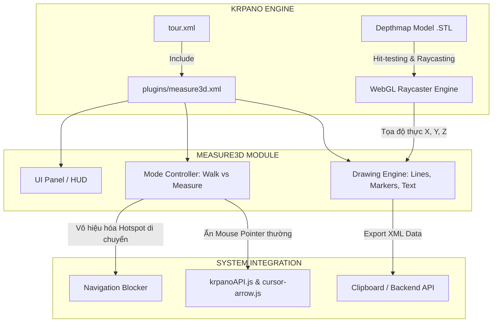

# Báo Cáo Tổng Hợp & Hướng Dẫn Kỹ Thuật: Chức Năng Thước Đo 3D (Measure3D Plugin) Trong Krpano

> **Dự án**: Căn hộ ảo 3D K-Home Avenue (Virtual Tour 360 Parallax & Depthmap)  
> **Tài liệu cho**: Thẻ `<include url="plugins/measure3d.xml" />` trong [tour.xml](file:///Users/gokuwebdev/Documents/GitHub/360.k-homeavenue.vn/dist/file360/can1pn/tour.xml#L4)  
> **Phiên bản Krpano hỗ trợ**: Krpano 1.22+ / 1.23 WebGL Depthmap Engine  
> **Ngày cập nhật**: 14/08/2026  

---

## 1. Tổng Quan Về Chức Năng `<include url="plugins/measure3d.xml" />`

Dòng lệnh `<include url="plugins/measure3d.xml" />` tại dòng số 4 trong file cấu hình `tour.xml` có nhiệm vụ nạp module **Thước đo không gian 3D (Measure3D)** vào tour thực tế ảo.

Đây là một tính năng chuyên sâu tận dụng kiến trúc **3D Mesh / Depthmap (file `model.stl`)** và hệ tọa độ không gian thật để cung cấp cho người xem khả năng đo đạc kích thước thực tế (chiều cao trần, chiều rộng cửa, khoảng cách đồ nội thất, diện tích khoảng trống...) trực tiếp trên trình duyệt web với độ chính xác cao.



---

## 2. Kiến Trúc Kỹ Thuật & Cơ Chế Hoạt Động (How It Works)

### 2.1. Cơ chế Dò tia (Raycasting) và Tọa độ Không gian 3D
1. **Raycasting từ con trỏ chuột (`cursorraycast`)**: Khi di chuyển chuột trên màn hình, Krpano phóng một tia từ camera ảo xuyên qua điểm ảnh chuột vào không gian 3D.
2. **Giao điểm với lưới 3D (`model.stl`)**: Tia cắt bề mặt 3D mesh tại tọa độ thực $(X, Y, Z)$ kèm theo vector pháp tuyến $(\vec{n}_x, \vec{n}_y, \vec{n}_z)$ của mặt phẳng va chạm.
3. **Tính toán Khoảng cách Euclid (3D Euclidean Distance)**:
   $$\text{Khoảng cách } (d) = \sqrt{(x_2 - x_1)^2 + (y_2 - y_1)^2 + (z_2 - z_1)^2}$$
4. **Tính toán Góc nghiêng/Độ dốc (Slope Angle)**:
   $$\text{Góc nghiêng } (\theta) = \left| \arctan2(-dy, \sqrt{dx^2 + dz^2}) \times \frac{180}{\pi} \right|^\circ$$

---

## 3. Chi Tiết Các Tính Năng Cốt Lõi Của `measure3d.xml`

### 3.1. Chuyển Đổi Trạng Thái Linh Hoạt (Segmented Mode Switch)
Giao diện đo đạc được tích hợp sẵn thanh gạt chuyển trạng thái (Segmented Toggle):
- **🚶 Đi (Walk Mode)**: Trạng thái xem tour thông thường. Toàn bộ hotspot chuyển scene, mũi tên điều hướng sàn (`hotspot_mouse`, `cursor-arrow`) và click-to-move hoạt động bình thường.
- **📏 Đo (Measure Mode)**: Bật chế độ đo. Tự động vô hiệu hóa các hotspot chuyển cảnh để không bị nhảy scene ngoài ý muốn khi người dùng double-click đo đạc.

### 3.2. Hai Phương Thức Đo Đạc Chuyên Nghiệp
1. **Đo giữa 2 điểm bất kỳ (Point-to-Point)**:
   - Double-click chọn **Điểm 1** (gốc đo).
   - Rê chuột tới **Điểm 2**, đường đo 3D nối dài theo thời gian thực.
   - Double-click để xác nhận chốt số đo.
2. **Đo giữa 2 bề mặt đối diện (Surface-to-Surface)**:
   - Bấm vào một điểm trên tường hoặc sàn.
   - Hệ thống tự động bắn một tia vuông góc theo vector pháp tuyến $(\vec{n}_x, \vec{n}_y, \vec{n}_z)$ sang bức tường hoặc trần đối diện và tự động tính khoảng cách lọt lòng mà không cần tìm điểm đích thủ công.

### 3.3. Tương Tác Xóa & Tùy Biến Số Đo
- Mỗi đường đo sinh ra một nhãn văn bản 3D (`measure3d_linetext`) nằm ngay tại trung điểm đoạn thẳng.
- **Xóa số đo**: Khi hover hoặc click vào nhãn số đo, nhãn chuyển sang trạng thái `❌ Delete`. Click lần nữa để xóa hoàn toàn đường đo đó khỏi không gian.

### 3.4. Xuất Dữ Liệu Đo Đạc (Save Measurements)
- Nút **💾 Lưu số đo** sẽ quét toàn bộ các đối tượng thước đo đang có trong không gian (`measure3d_line`, `measure3d_marker`, `measure3d_linetext`), trích xuất thành định dạng mã thẻ Krpano XML chuẩn và sao chép trực tiếp vào bộ nhớ tạm (Clipboard).

### 3.5. Đồng Bộ Đa Điểm Đứng (`keep="true"`)
- Tất cả các thành phần thước đo đều được gắn cờ `keep="true"`. Khi người dùng di chuyển sang các vị trí đứng (scene) khác trong căn hộ, các số đo đã vẽ vẫn được giữ nguyên vị trí trong không gian thực tế ảo nhờ chia sẻ chung một hệ quy chiếu từ Blender.

---

## 4. Bảng Cấu Hình Tham Số Trong `measure3d.xml`

Cấu trúc thẻ cấu hình gốc đặt ở đầu file [measure3d.xml](file:///Users/gokuwebdev/Documents/GitHub/360.k-homeavenue.vn/public/file360/can1pn/plugins/measure3d.xml#L14-L22):

```xml
<measure3d
    ui.bool="true"
    ui_pos.normal="left,10,0"
    ui_pos.mobile="lefttop,10,10"
    ui_dragable.bool="true"
    gap.number="0.0"
    showslope.bool="false"
    unit_format="roundval(v,1) + ' cm'"
/>
```

### Giải thích chi tiết các tham số:

| Thuộc Tính | Kiểu Dữ Liệu | Giá Trị Mặc Định | Mô Tả Chức Năng |
| :--- | :---: | :---: | :--- |
| `ui` | `boolean` | `true` | Bật/tắt thanh điều khiển HUD giao diện đo đạc trên màn hình. |
| `ui_pos.normal` | `string` | `"left,10,0"` | Vị trí neo của panel UI trên desktop: `[align, x, y]`. |
| `ui_pos.mobile` | `string` | `"lefttop,10,10"` | Vị trí neo của panel UI trên thiết bị di động / màn hình nhỏ. |
| `ui_dragable` | `boolean` | `true` | Cho phép người dùng kéo thả panel UI tự do trên màn hình. |
| `gap` | `number` | `0.0` | Khoảng cách bù offset theo phương pháp tuyến bề mặt để tránh hiện tượng dính hình (Z-fighting). |
| `showslope` | `boolean` | `false` | Hiển thị thêm góc nghiêng (độ dốc) bên dưới giá trị khoảng cách. |
| `unit_format` | `expression` | `"roundval(v,1) + ' cm'"` | Công thức format đơn vị đo. Hỗ trợ `' m'`, `' cm'`, `' mm'`. |

---

## 5. Hướng Dẫn Tích Hợp & Cách Sử Dụng

### 5.1. Nhúng vào file cấu hình Tour

Mở file `tour.xml` hoặc `config.xml` của căn hộ và thêm dòng sau vào phần đầu cấu hình (ngay sau thẻ `<krpano>`):

```xml
<krpano version="1.23" title="Virtual Tour">
    <!-- Nhúng plugin Thước đo 3D -->
    <include url="plugins/measure3d.xml" />

    <!-- Cấu hình bắt buộc để bật WebGL 3D Depth Engine -->
    <display depthmaprendermode="3dmodel" />
    <display depthbuffer="true" />
    ...
```

### 5.2. Điều Kiện Bắt Buộc Trong Scene Căn Hộ

Mỗi `<scene>` muốn hỗ trợ đo 3D cần phải chứa thẻ `<depthmap>` chỉ định đường dẫn tới mô hình 3D STL tương ứng:

```xml
<scene name="scene_1_1pn" title="Phòng Khách">
    <image ox="..." oy="..." oz="..." origin="..." align="..." prealign="...">
        <cube url="panos/1_1pn.tiles/%s/l%l/%0v/l%l_%s_%0v_%0h.jpg" multires="512,640,1152,2304,4736" />
        <!-- Lưới 3D dùng để tính toán va chạm raycasting -->
        <depthmap url="panos/1_1pn.tiles/model.stl" enabled="true" rendermode="3dmodel" background="none" scale="100" offset="0.0" hittest="true" />
    </image>
</scene>
```

### 5.3. Điều Khiển Bằng Javascript API

Bạn có thể gọi trực tiếp các action của `measure3d` từ code giao diện ngoài (Vue.js, React hoặc Vanilla JS):

```javascript
// Bật chế độ đo giữa 2 điểm
window.krpano.call("start_measuring_between_points(true);");

// Bật chế độ đo giữa 2 bề mặt
window.krpano.call("start_measuring_between_surfaces(true);");

// Dừng đo, quay về chế độ Walk
window.krpano.call("stop_measuring();");

// Xuất mã XML các số đo vào clipboard
window.krpano.call("save_measurements();");

// Kiểm tra tour có đang ở trạng thái đo hay không
const isMeasuring = window.krpano.get("measure3d_loop") === true;
```

---

## 6. Các Cơ Chế Giải Quyết Xung Đột Hệ Thống (Conflict Prevention)

Trong quá trình phát triển dự án thực tế ảo 3D K-Home Avenue, plugin `measure3d.xml` đã được bổ sung các cơ chế tối ưu đặc thù:

### 6.1. Ngăn Chặn Click Xuyên Thấu (Click-through UI Prevention)
- **Vấn đề**: Khi người dùng bấm vào các nút trên panel đo đạc, sự kiện click có thể xuyên qua panel xuống không gian 3D làm di chuyển camera hoặc vẽ sai điểm đo.
- **Giải pháp**:
  - Thiết lập `capture: true` và `bgcapture: true` trên layer `measure3d_ui`.
  - Bổ sung biến cờ `krpano.overMeasureUI = true/false` khi chuột hover vào panel để chặn đứng các bộ xử lý click sàn.

### 6.2. Ẩn Con Trỏ Mũi Tên Di Chuyển (`krpanoAPI.js` & `cursor-arrow.js`)
- **Vấn đề**: Con trỏ sàn 3D (`hotspot_mouse`, `hotspot_arrow_cursor`) và con trỏ đo 3D (`measure3d_cursor`) hiển thị đè lên nhau gây rối mắt.
- **Giải pháp**:
  - `krpanoAPI.js` và `cursor-arrow.js` liên tục kiểm tra biến cờ `krpano.measure3d_loop`. Nếu đang trong phiên đo, con trỏ di chuyển sẽ tự động ẩn đi (`visible = false`).

### 6.3. Khóa Chức Năng Chuyển Điểm (Navigation Lock)
- Khi gọi `measure3d_start`, biến `krpano.jyNavEnabled` được set sang `true` và toàn bộ các hotspot không thuộc nhóm `measure3d` đều bị chuyển sang `enabled = false`.
- Khi gọi `stop_measuring()`, hệ thống tự động khôi phục lại trạng thái `enabled = true` cho toàn bộ hotspot.

---

## 7. Các Lưu Ý Chuẩn & Best Practices Khi Sử Dụng

> [!IMPORTANT]
> **1. Yêu Cầu Về Tỷ Lệ Mô Hình 3D (Scale 1:1)**  
> - File `model.stl` xuất từ Blender phải sử dụng đơn vị chuẩn: **1 Unit = 1 Meter**.  
> - Trong thẻ `<depthmap>`, tham số `scale="100"` chuyển đổi 1m sang 100 đơn vị Krpano (cm). Nếu scale sai, giá trị thước đo hiển thị sẽ bị lệch so với thực tế.

> [!WARNING]
> **2. Xử Lý Hiện Tượng Nhấp Nháy Bề Mặt (Z-Fighting)**  
> - Khi đường kẻ (`measure3d_line`) nằm quá sát mặt sàn hoặc mặt tường, WebGL Depth Buffer có thể gây ra hiện tượng nét vẽ bị đứt đoạn hoặc nhấp nháy.  
> - Luôn đảm bảo trong style có các thuộc tính: `depthbuffer="false"`, `depthwrite="false"` và `depthoffset="-200"`.

> [!TIP]
> **3. Tùy Biến Đơn Vị Đo Theo Nhu Cầu Dự Án**  
> - Hiển thị Centimet (cm): `unit_format="roundval(v,1) + ' cm'"`  
> - Hiển thị Mét (m): `unit_format="roundval(v/100, 2) + ' m'"`  
> - Hiển thị Milimet (mm): `unit_format="roundval(v*10, 0) + ' mm'"`  

> [!NOTE]
> **4. Quy Tắc Đồng Bộ Mã Nguồn Giữa Các Mẫu Căn Hộ**  
> Dự án chia thành nhiều mẫu căn (`can1pn`, `can2pn`, `studio`...). Khi chỉnh sửa CSS hoặc tính năng trong `measure3d.xml`, hãy đảm bảo sao chép đồng bộ sang tất cả các thư mục tương ứng trong cả `public/` và `dist/` để tránh lệch phiên bản khi build sản phẩm.

---

## 8. Tóm Tắt Quy Trình Kiểm Thử (Verification Checklist)

| STT | Bước Kiểm Tra | Kết Quả Mong Đợi |
| :---: | :--- | :--- |
| 1 | Bật tab **📏 Đo** trên panel UI | Hotspot di chuyển chuyển sang trạng thái ẩn/vô hiệu hóa. |
| 2 | Double-click chọn 2 điểm trên sàn/tường | Đoạn thẳng nối liền xuất hiện kèm nhãn kích thước chính xác (cm). |
| 3 | Hover chuột vào nhãn số đo | Nhãn chuyển sang `❌ Delete`. Click để xóa thành công. |
| 4 | Chuyển sang scene/phòng khác | Các đường đo đã vẽ vẫn giữ nguyên vị trí trong không gian 3D. |
| 5 | Bấm **💾 Lưu số đo** | Thông báo popup hiển thị và mã XML đã được copy vào clipboard. |
| 6 | Bấm phím **ESC** hoặc tab **🚶 Đi** | Thoát chế độ đo, khôi phục lại khả năng di chuyển tự do. |
